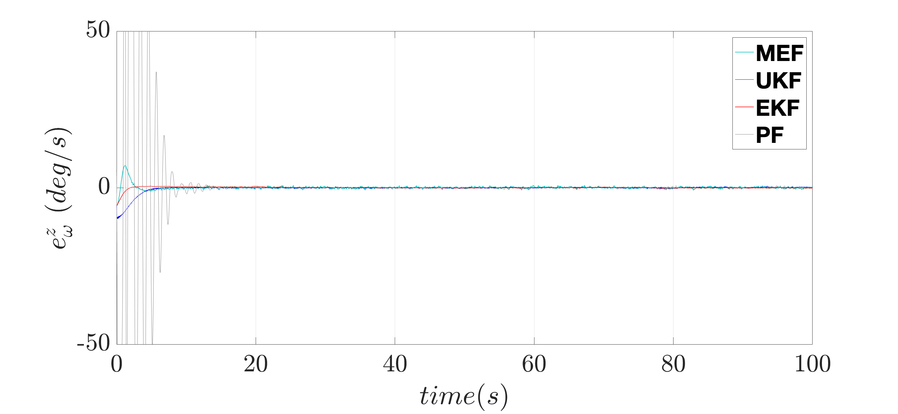

# attitude_estimation

This package provides attitude and rate estimation algorithms for aerial robotics applications. 
Observations are gyro-free and are based on two vectorial measurements.
Both the Extended Kalman filter and the Unscented Kalman filter are modified to include a symplectic integration step. This is how momentum and energy are preserved naturally.
A geometric filter and a second-order-optimal minimum energy filter are compared against the aforementioned Gaussian-approximate filters.

For both case studies, the measurement noise and model uncertainty are initially expressed under the stochastic reasoning. Subsequently, to stress the significance of the dual optimal control formulation, we replace the model error with an unknown deterministic disturbance that exerts on the existing system.

# Results
Model error for UAV: Stochastic approach (left), Deterministic approach (right)

  
   

  
   

  
   

  
   

